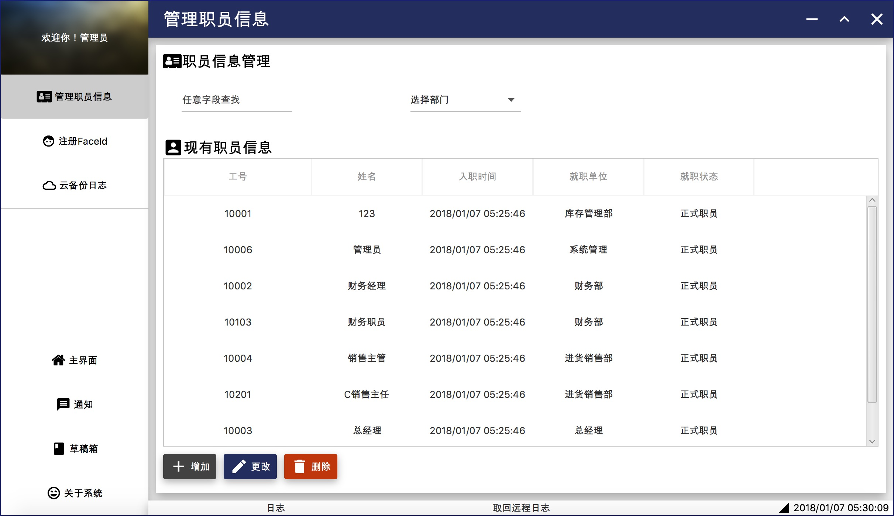
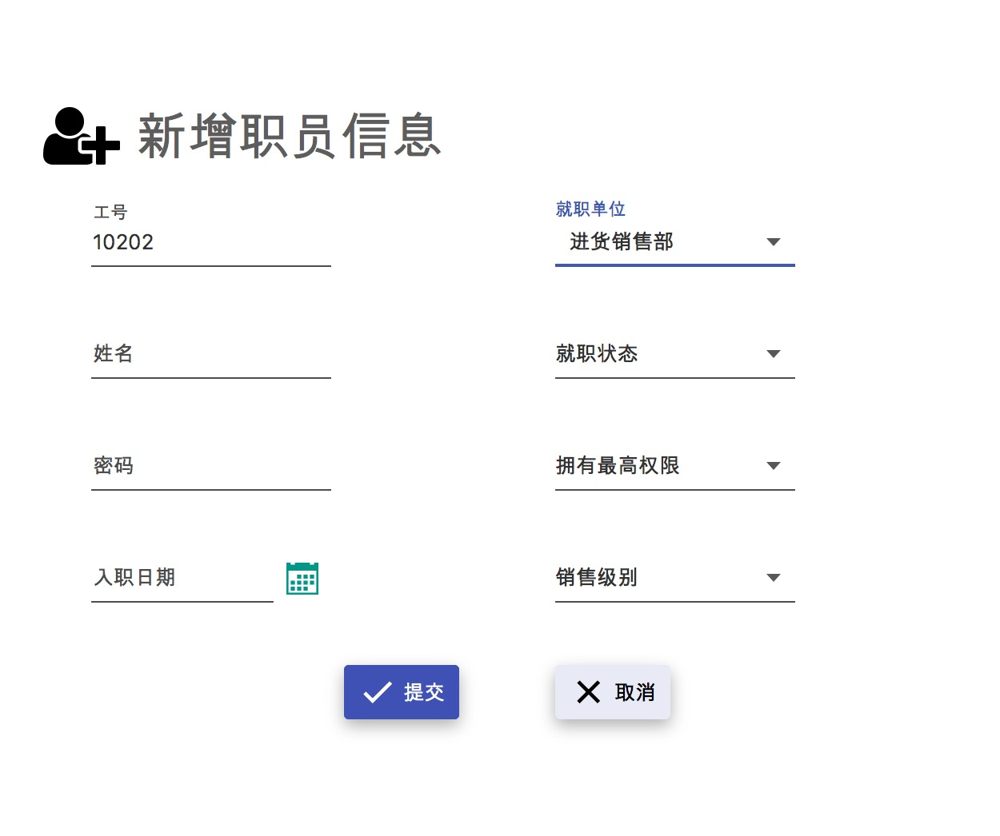

# Light x00 系统文档

<!-- TOC -->

- [Light x00 系统文档](#light-x00-系统文档)
    - [0. 更新日志](#0-更新日志)
- [1. 引言](#1-引言)
- [2. 初始化、配置](#2-初始化配置)
    - [2.1 初始化](#21-初始化)
    - [2.2 配置](#22-配置)
- [3. 操作](#3-操作)
    - [3.1 管理用户账户](#31-管理用户账户)
    - [3.2 人脸识别注册](#32-人脸识别注册)
    - [3.3 云备份日志](#33-云备份日志)

<!-- /TOC -->

## 0. 更新日志

| 修改日期     | 修改员  | 版本   | 变更原因 |
| -------- | ---- | ---- | ---- |
| 2018/1/7 | 张美玲  | V0.1 | 第一版  |
| 2018/1/7 | 陈俊达  | V1.0 | 完成文档 |

# 1. 引言

本文档是Light x00灯具进销存系统的系统文档，旨在帮助本系统的管理员以及系统管理者了解和维护本套系统。

# 2. 初始化、配置

## 2.1 初始化

1. 在服务器机器上配置好JDK 1.8。

2. 将`Lightx00.Server-all.jar`文件放在空目录下，并在此目录下运行命令`java -jar Lightx00.Server-all.jar`，当日志打出`Initialization Done`时即服务器初始化完毕。直接运行jar文件也是可以接受的，但是将不会有任何GUI或者Console显示，不推荐这样运行程序。

3. 服务器将会自动在jar文件所在目录下生成默认`config.json`文件和`database.db`文件。前者为一些功能参数的配置文件，详情请参考[2.2 配置](#2.2-配置)。后者为数据库文件。这两个文件一旦被删除或者重命名，系统将会使用默认配置文件进行替换。在使用Face ID功能后，将会在jar文件所在目录下生成`/faceIdImg/`

## 2.2 配置

`config.json`为本系统配置文件。默认配置文件如下：

```json
{
    "cognitiveService": {
        "api1": "80f6b11c822c4fc39dddd0ac8fbdcf09",
        "api2": "f210f2a3a2c044119b63129e70070d04",
        "endpoint" : "https://westcentralus.api.cognitive.microsoft.com/face/v1.0"
    },
    "logBackup": {
        "endpoint" : "http://oos-bj2.ctyunapi.cn",
        "bucketName": "lightx00",
        "accessKey": "c4582dec5d0809103126",
        "secretKey": "47c783687d4c452c5d71b817b8c481915fb0094a"
    }
}
```

其中，`cognitiveService`对象保存Face ID所需要的配置信息。本系统的Face ID功能使用了[微软认知服务(Microsoft Cognitivie Service)](https://azure.microsoft.com/zh-cn/services/cognitive-services/)的API。为了能够持续使用，公司应该去注册相关服务，并将获得**API Key(api1, api2)**以及**终结点(endpoint)**填入配置文件对应位置。

`logBackup`对象保存远程备份日志所需要的配置信息。本系统支持任何与**Amazon Web Service的API**兼容的云。请将云的**终结点(endpoint)**，**Bucket名(bucketName)**，**Access Key(accessKey)**以及**Secret Key(secretKey)**填入配置文件相关位置。

# 3. 操作

## 3.1 管理用户账户

管理员登录后，点击左侧的**管理职员信息**功能按钮或者主界面的**管理职员信息**按钮，进入管理职员信息界面。



要搜索姓名、工号、状态、单位可以直接输入关键字进行模糊查找。

要直接筛选单位可以在下拉菜单里选择。


点击**增加**按钮，增加一条新的职员信息。


关于职员信息，只有进货销售人员和财务人员有最高权限选择，只有进货销售人员有销售等级选择。

用户选择就职单位后，会显示相应分级信息。



要修改某职员信息，如职位调动、实习生转正式职员、正式职员离职等等，选中要修改的信息，点击**更改**按钮。


要删除某错误填写的职员信息，点击**删除**按钮。

## 3.2 人脸识别注册

点击左侧的**FaceID注册**功能按钮或者主界面的**FaceID注册**按钮，进入人脸识别登录界面。

要注册某职员的FaceID信息，先选择职员，再点击**注册**按钮。

## 3.3 云备份日志

点击左侧的**云备份日志**功能按钮或者主界面的**云备份日志**按钮，系统自动将本地日志清空，备份到云盘。

