#### 2.3.16 银行账户管理

点击左侧的**银行账户管理**功能按钮，进入银行账户管理界面。

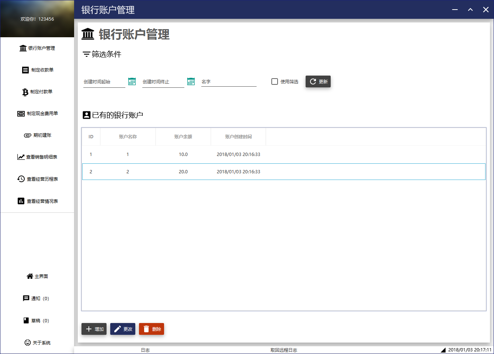

右侧从上到下依次为：标题栏，筛选条件，银行账户表格以及功能按钮。

要新增账户，请点击功能按钮区的**增加**按钮，将会弹出如下弹出框：

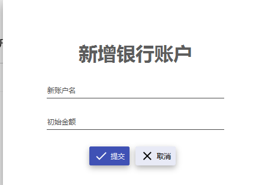

填写一个名称，例如"ABC"，以及初始金额，点击**提交**，将会成功添加。

要修改账户信息，请点击功能按钮区的**修改**按钮，将会弹出如下弹出框：

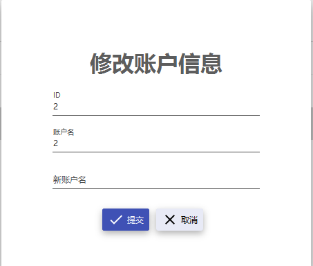

输入新名称，例如"23"，将会修改成功。

要删除一个银行账户，请点击功能按钮区的**删除**，将会弹出如下弹出框：

点击确定，将删除成功。

要筛选银行账户，请在筛选条件栏输入筛选信息，然后勾选**使用筛选条件**，点击刷新即可。

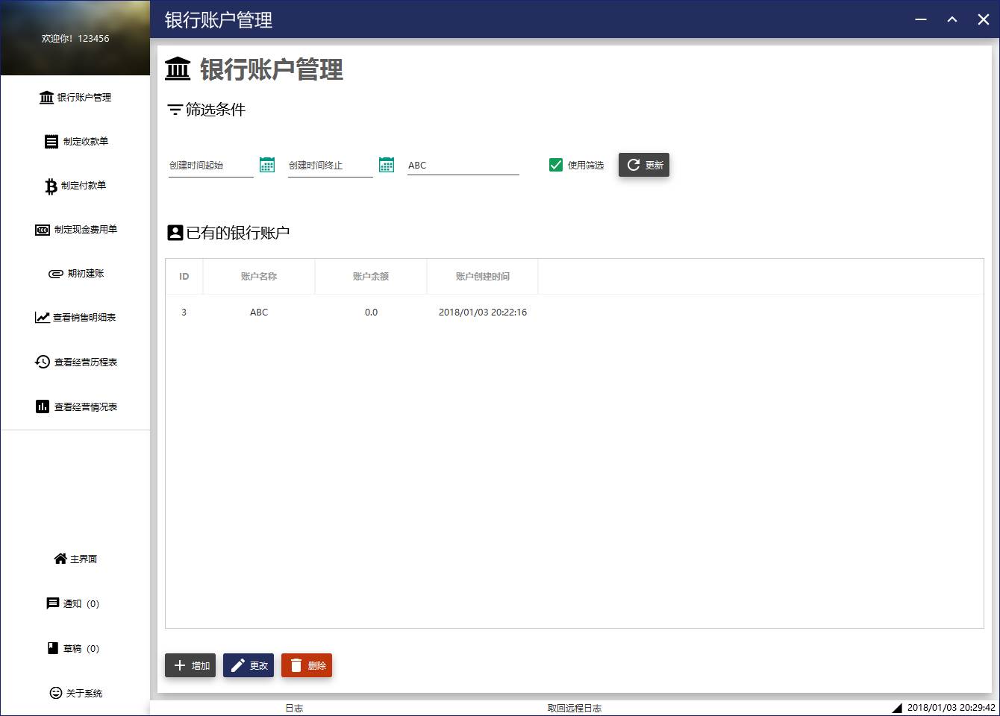

注意，系统允许重名的银行账户。

#### 2.3.17 制定付款单、收款单和现金费用单

由于单据操作是类似的，所以在本文档中，这两个用例写在同一个部分。下面以收款单做例子。

点击左侧的**制定收款单**功能按钮，进入制定收款单界面。

进入后，系统将会自动填写日期、ID和操作员信息。

点击客户栏，将会弹出选择客户的窗口。请选择一个客户后点击选择。如果需要搜索，在搜索框里填写任何条件并按下回车，系统将会执行模糊搜索。在现金费用单中是选择银行账户，相关操作参考下文。

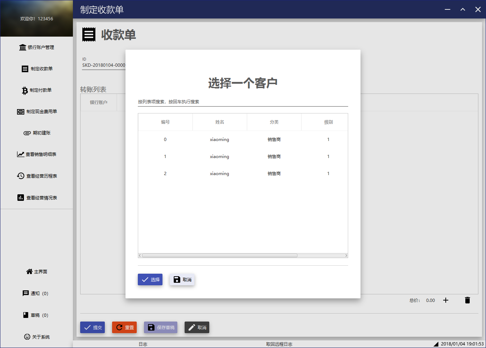

按下总价旁的**加号（+）**按键将会弹出增加转账项的弹出框。

点击**银行账户**栏将会弹出选择银行账户的窗口。在现金费用单中没有此项。

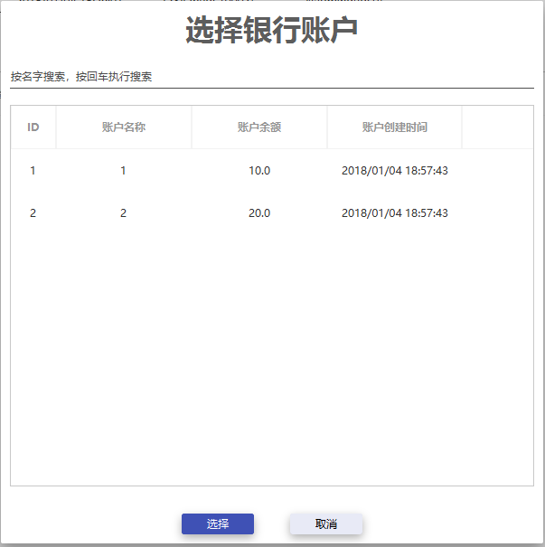

填写结束后，点击**提交**以添加转账项到表格。

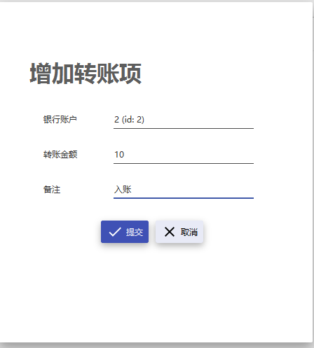

如果金额数字不是数字，那么将会有错误提示，并且将会拒绝提交。

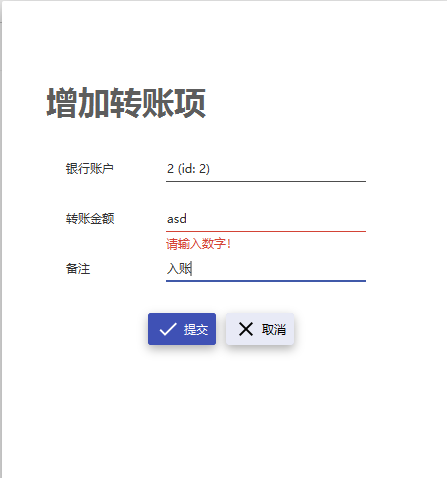

填写结束点击**提交**时，系统将会显示本次提交的单据信息用于确认。若确认，请点击确定。若不，请点击取消。

提交成功后，将会弹出如下对话框。点击继续填写可以继续填写另一张单据。

若有信息没有填写结束，系统将会提示未填写的信息并拒绝提交。

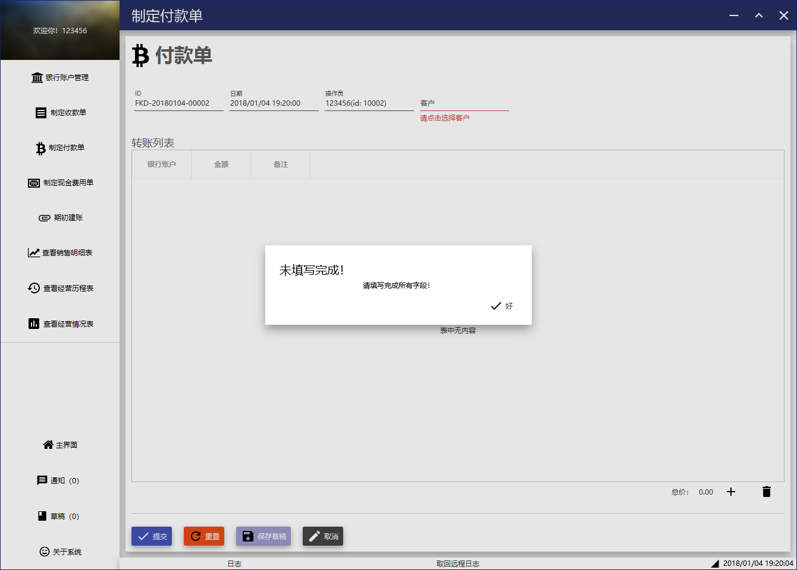

点击**重置**按钮将会弹出确认框。

确认后所有您填写的信息将会被丢弃。

可以点击**保存草稿**以将当前单据保存为草稿。

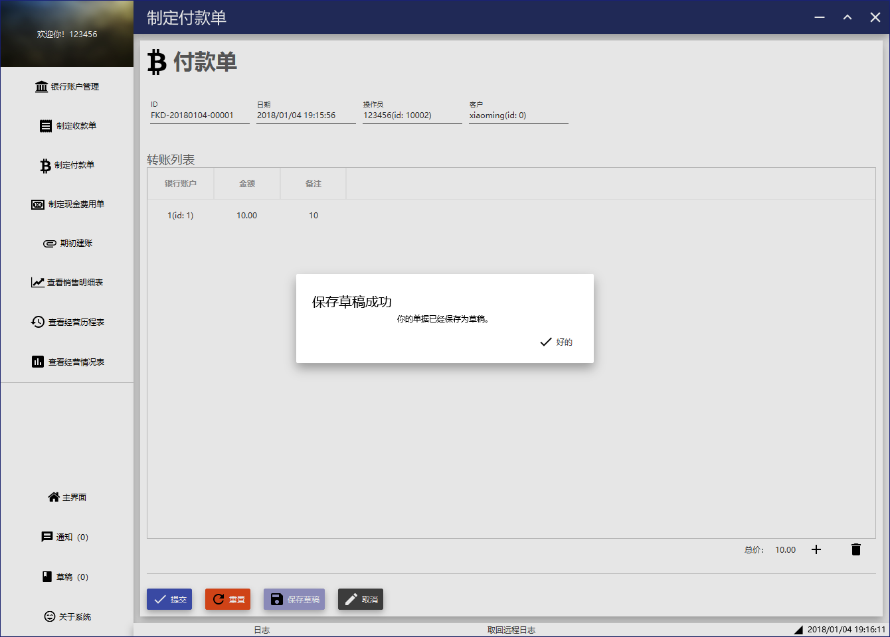

点击取消按钮会弹出确认框，可以选择保存草稿、不保存草稿以及取消这个操作。

#### 2.3.18 期初建账

点击左侧的**期初建账**按钮，将会进入期初建账的界面。

点击下文自动填写，将会自动填充页面上所有信息。

点击提交即可。点击取消也会自动返回主界面。

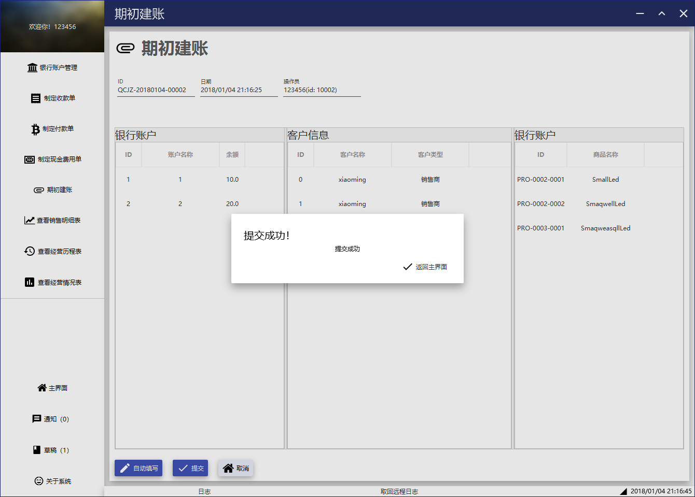

#### 2.3.19 查看销售明细表

点击左侧的**查看销售明细表**按钮，将会进入销售明细表界面。

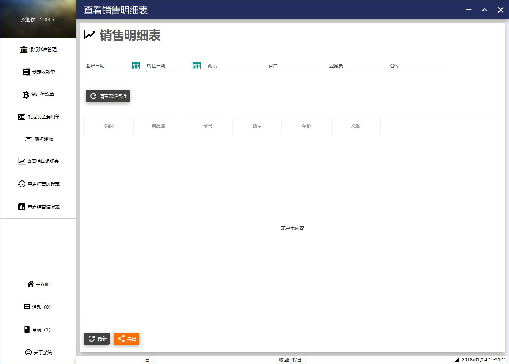

直接点击更新，将会刷新所有时间的销售明细信息。

可以选择筛选条件来筛选具体条件下的销售明细。

点击**导出**按钮，将会弹出选择文件路径对话框。其默认文件名格式为：**销售明细表-年\_月\_日-时\_分\_秒.xls**，其中时间为点击导出的时间。

导出成功后，将会弹出确认框，并包含导出文件的目录。

#### 2.3.20 查看经营历程表

点击左侧的**查看经营历程表**按钮，将会进入经营历程表界面。

点击**更新**将会获得所有单据。在输入**筛选条件**、勾选**使用筛选条件**后再点击更新，将会使用筛选条件进行筛选。

查询时将会获得所有除了草稿单据以为的单据，**包括正在等待审批和丢弃的单据**。

双击一个单据，或者选择一个单据后点击查看详细信息后，将会弹出单据的详细情况。

点击**红冲**将会跳转到对应单据的填写界面，并且会：

1. 自动获取新的新的ID和新的填写时间
2. 根据单据的具体情况，将数量或者金额取负。

接下来的操作同对应单据的填写操作。

点击**导出**按钮，将会弹出选择文件路径对话框。其默认文件名格式为：**经营历程表表-年\_月\_日-时\_分\_秒.xls**，其中时间为点击导出的时间。其他同[查看销售明细表](#2.3.19-查看销售明细表)。

#### 2.3.21 查看经营情况表

点击左侧的**查看经营情况表**按钮，将会进入经营情况表界面。

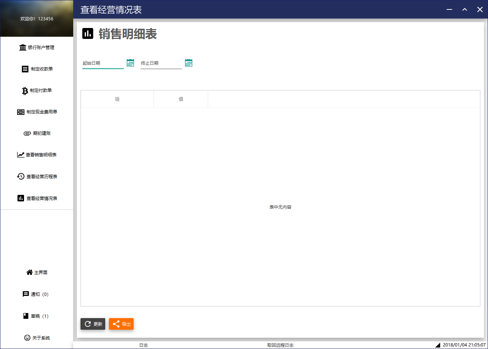

选择日期后，点击**更新**按钮，将会显示经营情况表。

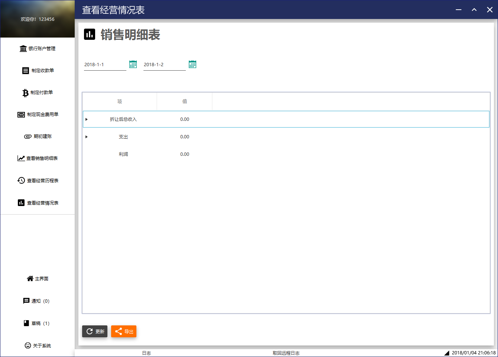

可以通过点击项左边的三角符号来展开或者收回某一具体项。

点击**导出**按钮，将会弹出选择文件路径对话框。其默认文件名格式为：**经营情况表-年\_月\_日-时\_分\_秒.xls**，其中时间为点击导出的时间。其他同[查看销售明细表](#2.3.19-查看销售明细表)。

#### 2.3.22 管理草稿箱

对于除了管理员外的其他用户，系统都提供了草稿箱功能。

点击左侧**草稿箱**或者人员功能主界面的**草稿箱**按钮即可进入草稿箱功能。

在这个界面您可以看到所有之前保存过的草稿。

点击**删除**按钮可以删除选中的草稿。

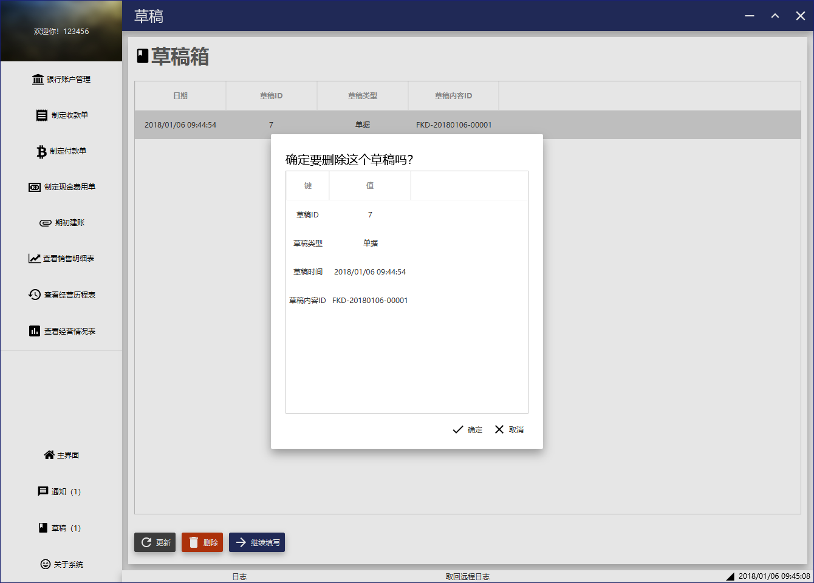

点击**继续填写**可以继续填写草稿。当确认时，将会跳往对应的单据填写界面。

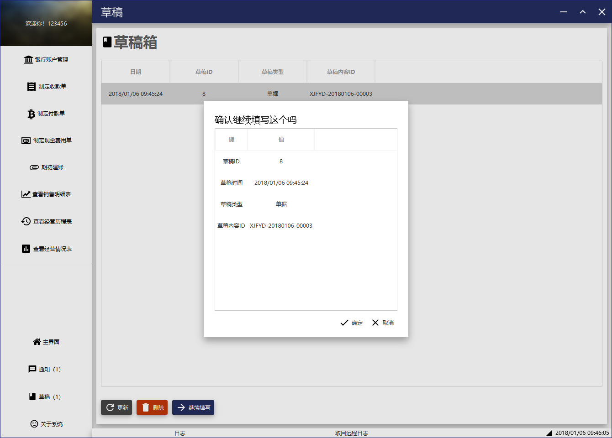

#### 2.3.23 管理通知

点击左侧**通知**或者人员功能主界面的**通知**按钮即可进入通知功能。

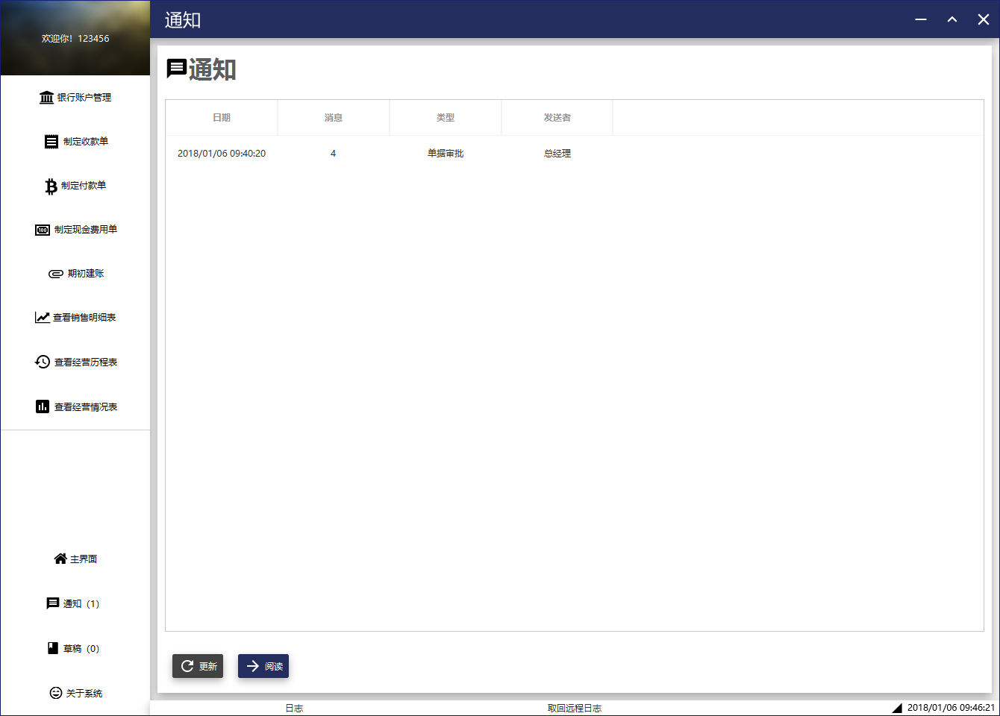

选中一个通知并点击**阅读**，可以查看这个通知的详细内容。

在单据审批的通知中，点击**修改**可以丢弃当前单据，并在此基础上跳回原填写单据界面进行修改。

点击**丢弃**可以直接丢弃当前单据。

如果审批结果是**已通过**，点击入账可以将此单据入账。

#### 2.3.24 日志

点击系统状态栏中的**日志**可以进入日志界面。

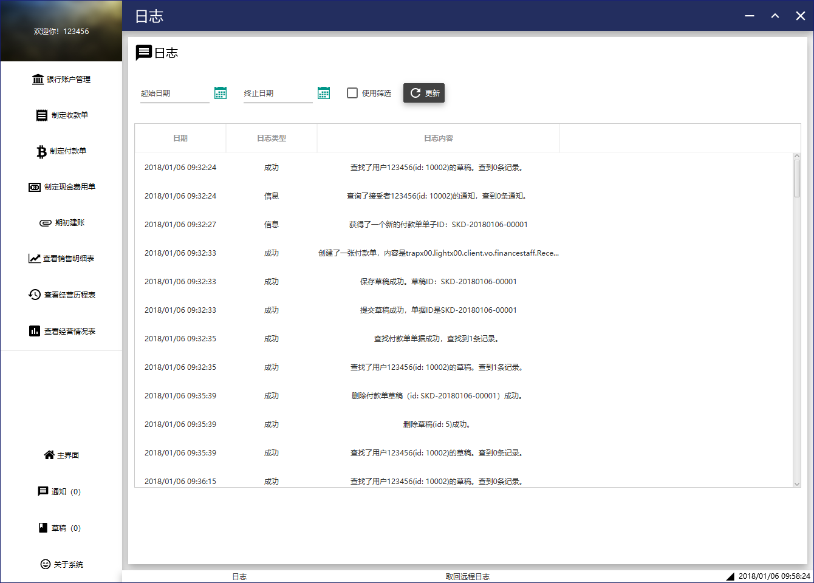

双击一条日志可以查看详情。

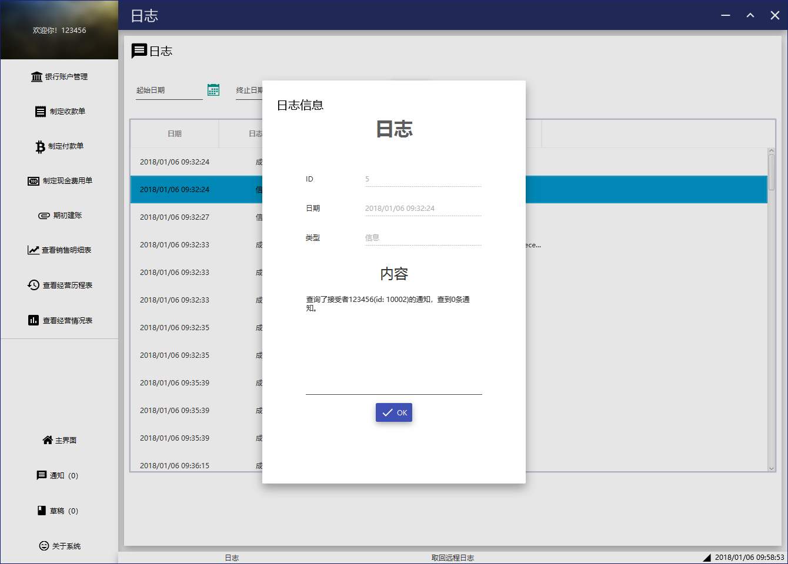

在筛选条件中可以选择筛选条件以筛选日志。

#### 2.3.33 管理远程日志

管理员可以备份远程日志。在管理员的界面中点击**云备份日志**，系统将自动清空服务器的所有日志，并将他们备份到远端。

管理员和财务人员可以查看远程日志。在状态栏里的点击**取回远程日志**，可以进入远程日志界面。双击一条可以自动打开浏览器访问远程日志。

