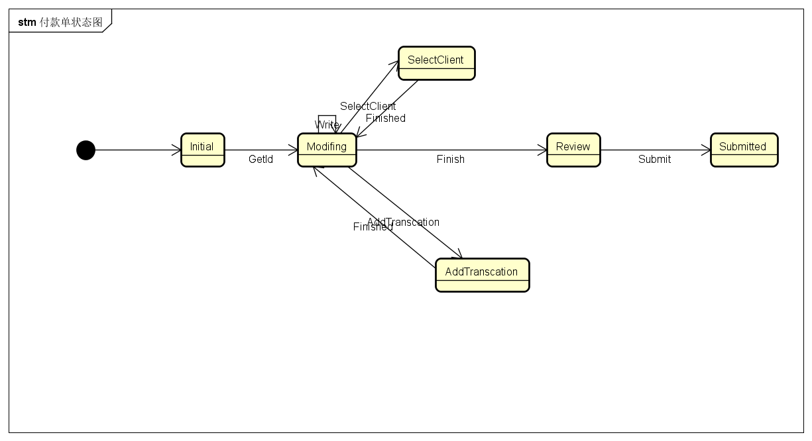

### 2.1.6 financeui包

#### 2.1.6.1 概述

financeui包负责财务人员除了银行账户管理外的用例（制定收款单、制定付款单、制定现金费用单、查看经营情况表、查看经营历程表、查看销售情况表、红冲以及期初建账）的UI界面以及响应控制代码。具体功能需求和非功能需求可参见需求规格说明文档和体系结构设计文档。

#### 2.1.6.2 整体结构

此包为展示层的一部分，它负责展示信息以及与用户的交互。它依赖它对应的financeblservice包与bl层进行交互。由于它有填写单据的用例，为了实现草稿箱、通知以及红冲功能，它还需要实现ContinueWritable接口。同时，填写单据的用例中需要选择客户，它还依赖clientui包所提供的选择客户的接口。

#### 2.1.6.3 设计

##### 2.1.6.3.1 设计图

##### 2.1.6.3.2 各个类的职责

| 类名 | 职责 |
|-----| -----|
| PaymentBillUiController | 负责管理填写付款单界面的展示和功能。|
| ReceivalBillUiController | 负责管理填写收款单界面的展示和功能。|
| CashBillUiController | 负责管理填写现金费用单界面的展示和功能。 |
| SystemSnapshotUiController | 负责管理期初建账界面的展示和功能。 |
| SaleDetailUiController | 负责管理销售明细表界面的展示和功能。|
| TradeHistoryUiController | 负责管理经营历程表界面的展示和功能（包括红冲功能）。 |
| TradeSituationUiController | 负责管理经营情况表界面的展示和功能。|

##### 2.1.6.3.3 内部类的接口规范

**PaymentBillUiController**

提供的接口

| 接口名称                                     | 语法                                       | 前置条件                         | 后置条件                                  |
| ---------------------------------------- | ---------------------------------------- | ---------------------------- | ------------------------------------- |
| ContinueWritable.continueWriting | `public PaymentBillUiController continueWriting(PaymentBillVo bill);` | 输入有效的用于继续填写单据。| 初始化传入单据的内容。 |

需要的接口

| 接口名称                                     | 服务名          |
| ---------------------------------------- | ------------ |
| `bankaccountui.BankAccountInfoUi.showBankAccountSelectDialog()` | 选择银行账户。|
| `clientui.ClientInfoUi.showClientSelectDialog() ` | 选择客户。|
| `financeblservice.PaymentBillBlService.submit(PaymentBillVo bill)` | 提交单据。|
| `financeblservice.PaymentBillBlService.saveAsDraft(PaymentBillVo bill)` | 保存草稿。|
| `financeblservice.PaymentBillBlService.getId()` | 获得当前单据的ID。|

**ReceivalBillUiController**

提供的接口

| 接口名称                                     | 语法                                       | 前置条件                         | 后置条件                                  |
| ---------------------------------------- | ---------------------------------------- | ---------------------------- | ------------------------------------- |
| ContinueWritable.continueWriting | `public ReceivalBillUiController continueWriting(ReceivalBillVo bill);` | 输入有效的用于继续填写的单据。| 初始化传入单据的内容。 |

需要的接口

| 接口名称                                     | 服务名          |
| ---------------------------------------- | ------------ |
| `bankaccountui.BankAccountInfoUi.showBankAccountSelectDialog()` | 选择银行账户。|
| `clientui.ClientInfoUi.showClientSelectDialog() ` | 选择客户。|
| `financeblservice.ReceivalBillBlService.submit(ReceivalBillVo bill)` | 提交单据。|
| `financeblservice.ReceivalBillBlService.saveAsDraft(ReceivalBillVo bill)` | 保存草稿。|
| `financeblservice.ReceivalBillBlService.getId()` | 获得当前单据的ID。|

**CashBillUiController**

提供的接口

| 接口名称                                     | 语法                                       | 前置条件                         | 后置条件                                  |
| ---------------------------------------- | ---------------------------------------- | ---------------------------- | ------------------------------------- |
| ContinueWritable.continueWriting | `public CashBillUiController continueWriting(CashBillVo bill);` | 输入有效的用于继续填写的单据。| 初始化传入单据的内容。 |

需要的接口

| 接口名称                                     | 服务名          |
| ---------------------------------------- | ------------ |
| `bankaccountui.BankAccountInfoUi.showBankAccountSelectDialog()` | 选择银行账户。|
| `financeblservice.CashBillBlService.submit(CashBillVo bill)` | 提交单据。|
| `financeblservice.CashBillBlService.saveAsDraft(CashBillVo bill)` | 保存草稿。|
| `financeblservice.CashBillBlService.getId() ` | 获得当前单据的ID。|

**InitialEstablishmentUiController**

提供的接口

| 接口名称                                     | 语法                                       | 前置条件                         | 后置条件                                  |
| ---------------------------------------- | ---------------------------------------- | ---------------------------- | ------------------------------------- |
| ContinueWritable.continueWriting | `public InitialEstablishmentUiController continueWriting(SystemSnapshotVo bill);` | 输入有效的用于继续填写的账。| 初始化传入单据的内容。 |

需要的接口

| 接口名称                                     | 服务名          |
| ---------------------------------------- | ------------ |
| `financeblservice.InitialEstablishmentBlService.autofill()` | 返回现有系统信息（所有商品信息、单据信息、银行账户信息）。|
| `financeblservice.InitialEstablishmentBlService.submit(SystemSnapshotVo snapshot)`     | 提交账。|
| `financeblservice.InitialEstablishmentBlService.saveAsDraft(SystemSnapshotVo snapshot)` | `public ResultMessage saveAsDraft(SystemSnapshotVo snapshot);` | 提交单据。|

**SaleDetailUiController**

需要的接口

| 接口名称                                     | 服务名          |
| ---------------------------------------- | ------------ |
| `clientui.ClientInfoUi.showClientSelectDialog() ` | 选择客户。|
| `adminui.AdminInfoUi.showEmployeeSelectDialog()` | 选择操作员。|
| `financeblservice.SaleDetailBlService.query(SaleDetailQueryVo query)` | 查询销售情况。|
| `financeblservice.SaleDetailBlService.export(SaleDetailVo detail)` | 导出报表。|

**TradeHistoryUiController**

需要的接口

| 接口名称                                     | 服务名          |
| ---------------------------------------- | ------------ |
| `clientui.ClientInfoUi.showClientSelectDialog() ` | 选择客户。|
| `adminui.AdminInfoUi.showEmployeeSelectDialog()` | 选择操作员。|
| `financeblservice.TradeHistoryBlService.query(TradeHistoryQueryVo query)` | 查询经营历程。|
| `financeblservice.TradeHistoryBlService.export(TradeHistoryVo history)` | 查询经营历程。|
| `helpui.ContinueWritable.continueWriting(T bill)` | 用于红冲时继续填写单据。|

**TradeSituationUiController**

需要的接口

| 接口名称                                     | 服务名          |
| ---------------------------------------- | ------------ |
| `financeblservice.TradeSituationBlService.query(TradeSituationQueryVo query)` | 查询经营情况。|
| `financeblservice.TradeSituationBlService.export(TradeSituationVo situation)` | 导出。|

##### 2.1.6.3.4 展示层的动态模型

下图为填写付款单时的PaymentBillVo对象的状态图。其他单据Vo对象同理。

### 2.1.7 bankaccountui包

#### 2.1.7.1 概述

bankaccountui包负责银行账户管理相关的UI的展示和功能实现。具体功能需求和非功能需求可参见需求规格说明文档和体系结构设计文档。

#### 2.1.7.2 整体结构

此包为展示层的一部分，它负责展示信息以及与用户的交互。它依赖它对应的financeblservice包与bl层进行交互。

#### 2.1.7.3 设计

##### 2.1.7.3.1 设计图

##### 2.1.7.3.2 各个类的职责

| 类名 | 职责 |
|-----| -----|
| BankAccountUiController | 负责管理银行账户的展示和功能实现。|

##### 2.1.7.3.3 内部类的接口规范

**BankAccountUiController**

提供的接口

| 接口名称                                     | 语法                                       | 前置条件                         | 后置条件                                  |
| ---------------------------------------- | ---------------------------------------- | ---------------------------- | ------------------------------------- |
| BankAccountInfoUi.showBankAccountSelectDialog | `public BankAccountVo[] showBankAccountSelectDialog();` | 无。| 弹出选择银行账户的窗口。|

需要的接口

| 接口名称                                     | 服务名          |
| ---------------------------------------- | ------------ |
| `bankaccountblservice.BankAccountManagementBlService.add(BankAccountVo newAccount)` | 添加账户信息。| 
| `bankaccountblservice.BankAccountManagementBlService.modify(BankAccountVo newAccount)` | 修改账户信息。|
| `bankaccountblservice.BankAccountManagementBlService.query(BankAccountQueryVo query)` | 查询账户信息。|
| `bankaccountblservice.BankAccountManagementBlService.delete(BankAccountVo account)` | 删除账户信息。|
