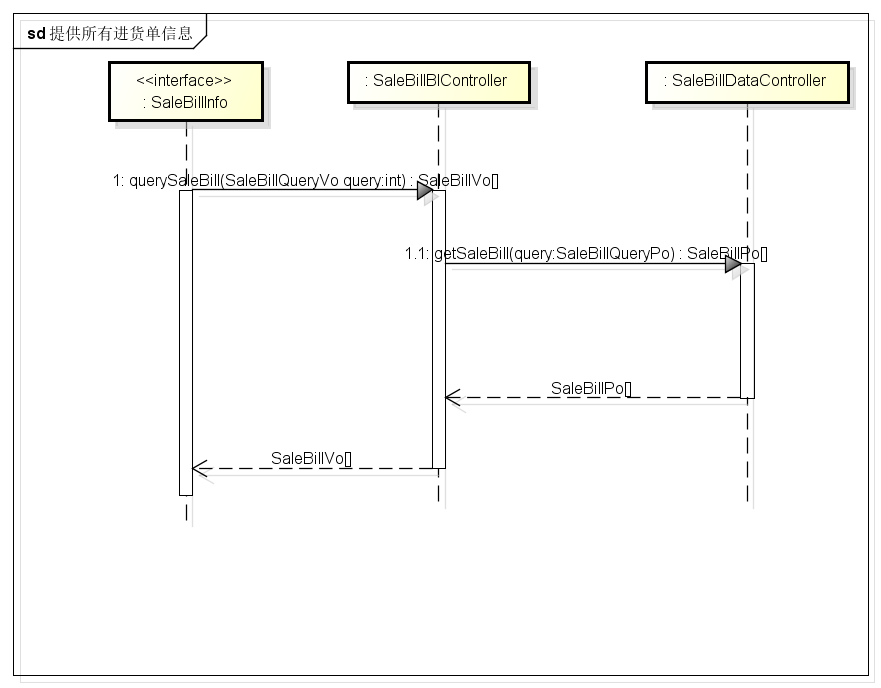
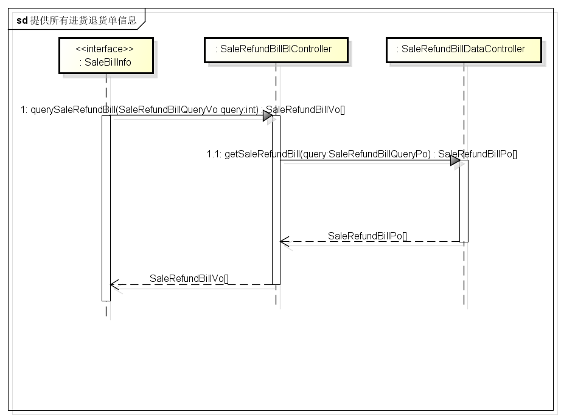
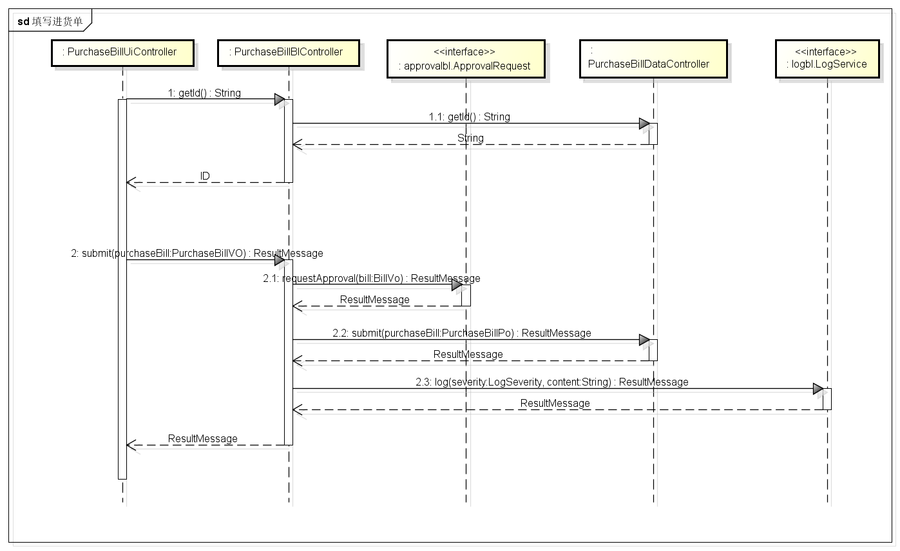

### 2.2.6 clientbl包

#### 2.2.6.1 概述

clientbl包负责进货销售人员客户管理用例的业务逻辑实现代码。具体功能需求和非功能需求可参见需求规格说明文档和体系结构设计文档。

#### 2.2.6.2 整体架构

此包为业务逻辑层层的一部分，它负责展示信息以及与用户的交互。它实现了clientui包所需要的clientblservice的所有接口，并依赖clientdataservice包与data层进行交互。

#### 2.2.6.3 设计

##### 2.2.6.3.1 设计图

clientbl模块的设计如图

##### 2.2.6.3.2 各个类的职责

| 类名                 | 职责              |
| ------------------ | --------------- |
| ClientBlController | 负责实现客户信息的增删查改操作 |

##### 2.2.6.3.3 内部类的接口规范

**ClientBlController**

提供的接口

| 接口名称                        | 语法                                       | 前置条件      | 后置条件                  |
| --------------------------- | ---------------------------------------- | --------- | --------------------- |
| ClientBlService.query       | `public ClientVo[] query(String query);` | 无。        | 数据库给出符合条件的客户信息。       |
| ClientBlService.saveAsDraft | `public ResultMessage saveAsDraft(ClientVo client);` | 客户信息信息非空。 | 保存草稿，持久化信息已经保存。       |
| ClientBlService.getId       | `public String getId(); `                | 无。        | 获得新客户的ID。             |
| ClientBlService.add         | `public ResultMessage add(ClientVo client);` | 客户所有属性有效。 | 客户已经保存到数据库，持久化信息已经保存。 |
| ClientBlService.delete      | `public ResultMessage delete(ClientVo[] client);` | 客户非空。     | 数据库删除客户信息，持久化信息已经保存。  |
| ClientBlService.detail      | `public ResultMessage detail(ClientVo client);` | 无。        | 数据库返回该客户的详细信息。        |
| ClientModificationService.modifyClient|`public ResultMessage modifyClient(ClientVo client);`|无。 | 数据库修改用户信息。|

需要的接口

| 接口名称                                     | 服务名           |
| ---------------------------------------- | ------------- |
| `clientdataservice.ClientDataService.query(String query);` | 根据查询条件查询客户信息。 |
| `clientdataservice.ClientDataService.saveAsDraft(ClientPO client);` | 保存客户草稿。       |
| `clientdataservice.ClientDataService.getId();` | 获得新客户的ID。     |
| `clientdataservice.ClientDataService.modify(ClientPO client); ` | 修改客户信息。       |
| `clientdataservice.ClientDataService.add(ClientPO client);` | 添加客户。         |
| `clientdataservice.ClientDataService.delete| ClientBlService.query      | `public ClientVo[] query(String query);` | 无。            |
| `clientdataservice.ClientDataService.detail(ClientPO client);` | 查询客户详细信息。     |
| `draftbl.DraftService.saveAsDraft(ClientVo bill)` | 保存草稿。         |

##### 2.2.6.3.4  业务逻辑层的动态模型

如下图表示了在进销存系统中，当进货销售人员想要查看客户详细信息的时候，客户管理业务逻辑处理的相关对象之间的协作

如下图表示了在进销存系统中，当进货销售人员想要删除客户的时候，客户管理业务逻辑处理的相关对象之间的协作

如下图表示了在进销存系统中，当进货销售人员想要搜索客户的时候，客户管理业务逻辑处理的相关对象之间的协作

如下图表示了在进销存系统中，当进货销售人员在填写客户信息的时候，客户管理业务逻辑处理的相关对象之间的协作

如下图表示了在进销存系统中，当进货销售人员在想要将客户信息保存为草稿的时候，客户管理业务逻辑处理的相关对象之间的协作

### 2.2.7 salebl包

#### 2.2.6.1 概述

salebl包负责进货销售人员与销售有关的用例（制定销售单、制定销售退货单）的业务逻辑实现代码。具体功能需求和非功能需求可参见需求规格说明文档和体系结构设计文档。

#### 2.2.6.2 整体架构

此包为业务逻辑层层的一部分，它负责展示信息以及与用户的交互。它实现了saleui包所需要的saleblservice的所有接口，并依赖saledataservice包与data层进行交互。

#### 2.2.6.3 设计

##### 2.2.6.3.1 设计图

salebl模块的设计如图

##### 2.2.6.3.2 各个类的职责

| 类名                         | 职责                   |
| -------------------------- | -------------------- |
| SaleBillBlController       | 负责实现销售单的填写、修改、提交功能   |
| SaleRefundBillBlController | 负责实现销售退货单的填写、修改、提交功能 |

##### 2.2.6.3.3 内部类的接口规范

**SaleBillBlController**

提供的接口

| 接口名称                            | 语法                                       | 前置条件          | 后置条件                             |
| ------------------------------- | ---------------------------------------- | ------------- | -------------------------------- |
| SaleBillBlService.submit        | `public ResultMessage submit(SaleBillVO saleBill);` | 表单数据输入格式正确。   | 持久化层新增表单信息。                      |
| SaleBillBlService.saveAsDraft   | `public ResultMessage saveAsDraft(SaleBillVO saleBill);` | 用户已经点击保存草稿。   | 持久化层保存草稿信息。                      |
| SaleBillBlService.getId         | `public String getId(); `                | 无。            | 获得新单据的ID。                        |
| SaleBillBlService.getPromotion  | `public Promotion[] getPromotion(SaleBillVo saleBill); ` | 销售单已经填写完。     | 获得可用的销售策略。                       |
| SaleBillBlInfo.querySaleBill    | `public SaleBillVo[] querySaleBill(SaleBillQueryVo query); ` | 无。            | 获得所有单据信息。                        |
| NotificationActivation.activate | `public ResultMessage activate(SaleBillVo bill);` | 单据有效且状态为审批通过。 | 系统修改对应客户信息，修改单据状态为已入账，持久化信息已经保存。 |
| NotificationActivation.abandon  | `public ResultMessage abandon(SaleBillVo bill);` | 单据有效且状态为审批完成。 | 系统修改单据状态为已经废弃，持久化信息已经保存。         |

需要的接口

| 接口名称                                     | 服务名             |
| ---------------------------------------- | --------------- |
| `saledataservice.SaleBillDataService.submit(SaleBillPO saleBill);` | 提交表单。           |
| `saledataservice.SaleBillDataService.getId();` | 获得新单据的ID。       |
| `saledataservice.SaleBillDataService.getSaleBill(SaleBillQueryPo query);` | 获得指定的销售单。       |
| `promotionbl.PromotionInfoBl.queryPromotion(SaleBillVo);` | 根据销售单获得可用的促销策略。 |
| `saledataservice.SaleBillDataService.activate(SaleBillPo bill) ` | 使单据生效。          |
| `saledataservice.SaleBillDataService.abandon(SaleBillPo bill)` | 废弃单据。           |
| `logbl.LogService.log(LogSeverity severity, String content)` | 记录日志。           |
| `draftbl.DraftService.saveAsDraft(SaleBillPo bill)` | 保存草稿。           |

**SaleRefundBillBlController**

提供的接口

| 接口名称                                | 语法                                       | 前置条件          | 后置条件                             |
| ----------------------------------- | ---------------------------------------- | ------------- | -------------------------------- |
| SaleBillRefundBlService.submit      | `public ResultMessage[] submit(SaleRefundBillVO saleRefundBill);` | 表单数据输入格式正确。   | 持久化层新增表单信息。                      |
| SaleBillRefundBlService.saveAsDraft | `public ResultMessage saveAsDraft(SaleRefundBillVO saleRefundBill);` | 用户已经点击保存草稿。   | 持久化层保存草稿信息。                      |
| SaleBillRefundBlService.getId       | `public String getId(); `                | 无。            | 获得新单据的ID。                        |
| SaleBillBlInfo.querySaleRefundBill        | `public SaleRefundBillVo[] querySaleRefundBill(SaleRefundBillQueryVo query); ` | 无。            | 获得所有单据信息。                        |
| NotificationActivation.activate     | `public ResultMessage activate(SaleRefundBillVo bill);` | 单据有效且状态为审批通过。 | 系统修改对应客户信息，修改单据状态为已入账，持久化信息已经保存。 |
| NotificationActivation.abandon      | `public ResultMessage abandon(SaleRefundBillVo bill);` | 单据有效且状态为审批完成。 | 系统修改单据状态为已经废弃，持久化信息已经保存。         |

需要的接口

| 接口名称                                     | 服务名         |
| ---------------------------------------- | ----------- |
| `saledataservice.SaleRefundBillDataService.submit(SaleRefundBillPO saleRefundBill);` | 提交表单。       |
| `saledataservice.SaleRefundBillDataService.getId();` | 获得新单据的ID。   |
| `saledataservice.SaleRefundBillDataService.getSaleRefundBill(SaleRefundBillQueryPo query);` | 获得指定的销售退货单。 |
| `saledataservice.SaleRefundBillDataService.activate(SaleRefundBillPO bill) ` | 使单据生效。      |
| `saledataservice.SaleRefundBillDataService.abandon(SaleRefundBillPO bill)` | 废弃单据。       |
| `logbl.LogService.log(LogSeverity severity, String content)` | 记录日志。       |
| `draftbl.DraftService.saveAsDraft(SaleRefundBillPO bill)` | 保存草稿。       |

##### 2.2.6.3.4  业务逻辑层的动态模型

如下图表示了在进销存系统中，当进货销售人员想要查看所有销售单信息的时候，客户管理业务逻辑处理的相关对象之间的协作

如下图表示了在进销存系统中，当进货销售人员想要查看所有销售退货单信息的时候，客户管理业务逻辑处理的相关对象之间的协作

如下图表示了在进销存系统中，当进货销售人员填写销售单的时候，客户管理业务逻辑处理的相关对象之间的协作

如下图表示了在进销存系统中，当进货销售人员想要将销售单保存为草稿的时候，客户管理业务逻辑处理的相关对象之间的协作

如下图表示了在进销存系统中，当进货销售人员填写销售退货单的时候，客户管理业务逻辑处理的相关对象之间的协作

如下图表示了在进销存系统中，当进货销售人员想要将销售退货单保存为草稿的时候，客户管理业务逻辑处理的相关对象之间的协作

### 2.2.7 inventorybl包

#### 2.2.6.1 概述

inventorybl包负责与库存相关的用例（包括进货销售人员的制定进货单、制定进货退货单）的业务逻辑实现代码。具体功能需求和非功能需求可参见需求规格说明文档和体系结构设计文档。

#### 2.2.6.2 整体架构

此包为业务逻辑层层的一部分，它负责展示信息以及与用户的交互。它实现了inventoryui包所需要的inventoryblservice的所有接口，并依赖inventorydataservice包与data层进行交互。

#### 2.2.6.3 设计

##### 2.2.6.3.1 设计图

##### 2.2.6.3.2 各个类的职责

| 类名                             | 职责                   |
| ------------------------------ | -------------------- |
| PurchaseBillBlController       | 负责实现进货单的填写、修改、提交功能   |
| PurchaseBillRefundBlController | 负责实现进货退货单的填写、修改、提交功能 |

##### 2.2.6.3.3 内部类的接口规范

**PurchaseBillBlController**

提供的接口

| 接口名称                                   | 语法                                       | 前置条件          | 后置条件                             |
| -------------------------------------- | ---------------------------------------- | ------------- | -------------------------------- |
| PurchaseBillBlService.submit           | `public ResultMessage submit(PurchaseBillVO purchaseBill);` | 表单数据输入格式正确。   | 持久化层新增表单信息。                      |
| PurchaseBillBlService.saveAsDraft      | `public ResultMessage saveAsDraft(PurchaseBillVO purchaseBill);` | 表单数据非空。       | 持久化层保存草稿信息。                      |
| PurchaseBillBlService.getId            | `public String getId(); `                | 无。            | 获得新单据的ID。                        |
| PurchaseBillBlInfo.queryPurchaseBillVo | `public PurchaseBillVo[] queryPurchaseBillVo(PurchaseBillQueryVo query); ` | 无。            | 获得所有单据信息。                        |
| NotificationActivation.activate        | `public ResultMessage activate(PurchaseBillVO bill);` | 单据有效且状态为审批通过。 | 系统修改对应客户信息，修改单据状态为已入账，持久化信息已经保存。 |
| NotificationActivation.abandon         | `public ResultMessage abandon(PurchaseBillVO bill);` | 单据有效且状态为审批完成。 | 系统修改单据状态为已经废弃，持久化信息已经保存。         |

需要的接口

| 接口名称                                     | 服务名       |
| ---------------------------------------- | --------- |
| `inventorydataservice.PurchaseBillDataService.submit(PurchaseBillPO purchaseBill);` | 提交表单。     |
| `inventorydataservice.PurchaseBillDataService.getId();` | 获得新单据的ID。 |
| `inventorydataservice.PurchaseBillDataService.getPurchaseBill(PurchaseBillQueryPo query);` | 获得指定的进货单。 |
| `inventorydataservice.PurchaseBillDataService.saveAsDraft(PurchaseBillPO purchaseBill);` | 保存草稿。     |
| `logbl.LogService.log(LogSeverity severity, String content)` | 记录日志。     |
| `draftbl.DraftService.saveAsDraft(PurchaseBillPO bill)` | 保存草稿。     |

**PurchaseRefundBillBlController**

提供的接口

| 接口名称                                     | 语法                                       | 前置条件          | 后置条件                             |
| ---------------------------------------- | ---------------------------------------- | ------------- | -------------------------------- |
| PurchaseRefundBillBlService.submit       | `public ResultMessage submit(PurchaseRefundBillVO purchaseRefundBill);` | 表单数据输入格式正确。   | 持久化层新增表单信息。                      |
| PurchaseRefundBillBlService.saveAsDraft  | `public ResultMessage saveAsDraft(PurchaseRefundBillVO purchaseRefundBill);` | 表单数据非空。       | 持久化层保存草稿信息。                      |
| PurchaseRefundBillBlService.getId        | `public String getId(); `                | 无。            | 获得新单据的ID。                        |
| PurchaseBillInfo.queryPurchaseRefundBillVo | `public PurchaseRefundBillVo[] queryPurchaseRefundBillVo(PurchaseRefundBillVo query); ` | 无。            | 获得所有单据信息。                        |
| NotificationActivation.activate          | `public ResultMessage activate(PurchaseRefundBillVO bill);` | 单据有效且状态为审批通过。 | 系统修改对应客户信息，修改单据状态为已入账，持久化信息已经保存。 |
| NotificationActivation.abandon           | `public ResultMessage abandon(PurchaseRefundBillVO bill);` | 单据有效且状态为审批完成。 | 系统修改单据状态为已经废弃，持久化信息已经保存。         |

需要的接口

| 接口名称                                     | 服务名         |
| ---------------------------------------- | ----------- |
| `inventorydataservice.PurchaseRefundBillDataService.submit(PurchaseRefundBillPO purchaseRefundBill);` | 提交表单。       |
| `inventorydataservice.PurchaseRefundBillDataService.getId();` | 获得新单据的ID。   |
| `inventorydataservice.PurchaseRefundBillDataService.getPurchaseRefundBill(PurchaseRefundBillQueryPo query);` | 获得指定的进货退货单。 |
| `inventorydataservice.PurchaseRefundBillDataService.saveAsDraft(PurchaseRefundBillPO purchaseRefundBill);` | 保存草稿。       |
| `logbl.LogService.log(LogSeverity severity, String content)` | 记录日志。       |
| `draftbl.DraftService.saveAsDraft(PurchaseRefundBillPO bill)` | 保存草稿。       |

##### 2.2.6.3.4  业务逻辑层的动态模型

如下图表示了在进销存系统中，当进货销售人员想要查看所有进货单信息的时候，客户管理业务逻辑处理的相关对象之间的协作

如下图表示了在进销存系统中，当进货销售人员想要查看所有进货退货单信息的时候，客户管理业务逻辑处理的相关对象之间的协作

如下图表示了在进销存系统中，当进货销售人员填写进货单的时候，客户管理业务逻辑处理的相关对象之间的协作

如下图表示了在进销存系统中，当进货销售人员想要将进货单保存为草稿的时候，客户管理业务逻辑处理的相关对象之间的协作

如下图表示了在进销存系统中，当进货销售人员填写进货退货单的时候，客户管理业务逻辑处理的相关对象之间的协作

如下图表示了在进销存系统中，当进货销售人员想要将进货退货单保存为草稿的时候，客户管理业务逻辑处理的相关对象之间的协作

